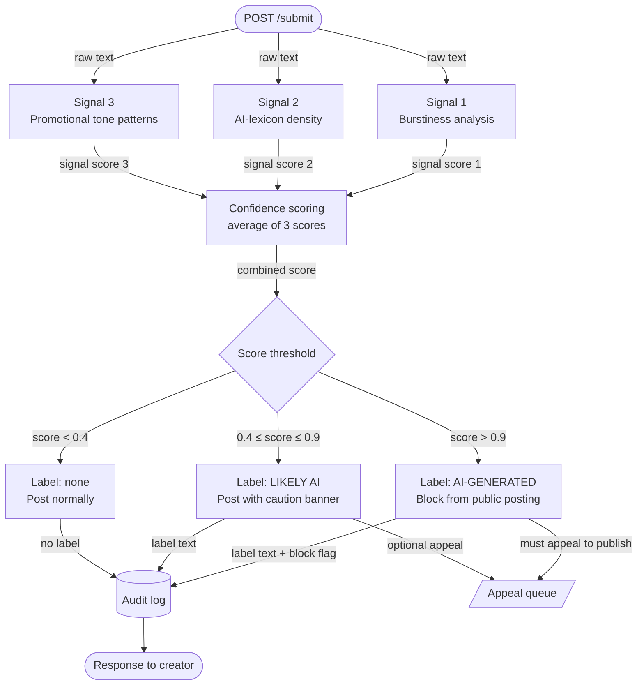
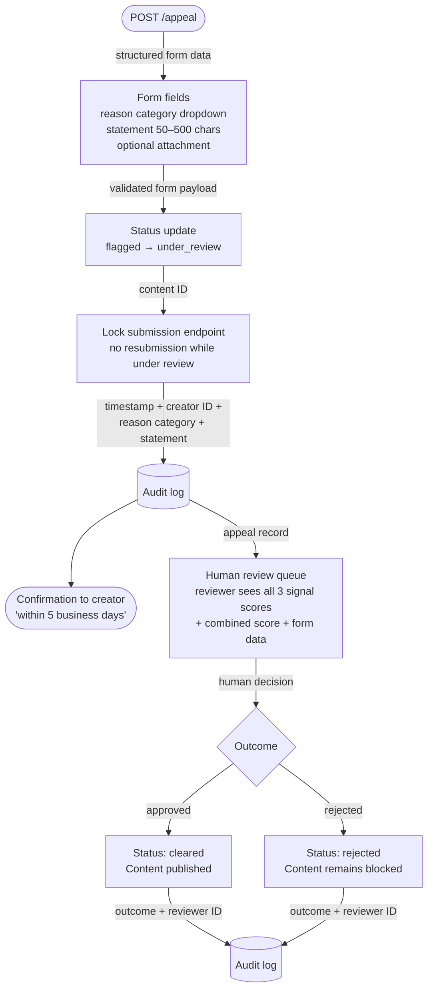

# System design structure

This project is designed to distinguish between a human-created work and AI-generated work, which is a big recent problem as AI slop is a rising phenomenon, which continues to degrade model accuracy and degrade user experience (as people are having to view trash content which is generated by artificial intelligence). Because of that, we need some sorts of system design in this picture.

## Detection signals

For this scope of the assignment, we will only consider text-based. There are different signals concerning AI, as Wikipedia talked about in [an article](https://en.wikipedia.org/wiki/Wikipedia:Signs_of_AI_writing).

### Some signals I will consider
1. Burstiness of the word signals: human do write complex but simple word patterns, and irregular patterns, shaped by a period of writing and texting culture. Some AI-generated posts are very bursty and sometimes do have words that are so repetitive
2. Some random cliches: AI-lexicon density: this is a score because just getting this score does not mean this is AI, humans could learn from these kinds of text structure and generate its own burstiness parameter so I will only judge the text in front of other parts of the post itself.
3. Promotional/inflating tone patterns -- AI-generated texts increasingly have emojies in the texts, even in carefully-prompted settings, the output is overwhelmingly ChatGPT-specific in this case. In this case, I will consider the rate of these patterns using patterns analysis (machine learning could resolve that), text structures and separate headings that are considered AI (NOTE: nowadays vibe coding and prompt engineering has surpassed all this, but putting a paper trail into these kinds of issues are far much of a nowadays' problem that we need to face).

## Uncertainty signaling

Now, the uncertainty signaling is: because mistakening human-generated text with AI-generated (false-positive) could be very damaging to human reputation, we will only consider obvious matches and obvious pattern matches (again, there are other forms like hallucinations of facts, but they are too complex and require human-authorized judgment). Because of this complexity, I will only grade a text that is AI-generated to be 0.9 or more.

The variants to signal uncertainty will be decorated as:

- \>0.9: AI generated
- 0.4-0.9: uncertain -- consider when reading
- \<0.4: human-generated text

## Appeal mechanism

The appeal mechanism that I would consider is: I will use an appeal system: within 48 hours of the content being flagged, the content will be available for human-appeal. Because a 90-95% confidence shows that it's an AI, you have to get some evidence that you write the work itself: you have to write stuff, write letter drafts that it is consistently important.

## Anticipated edge cases

Most AI detectors have erroneous edge cases, and some of them are public and have triggered significant scrutiny — most famously, the U.S. Declaration of Independence being flagged as AI-generated by several commercial tools ([source](https://www.popularai.org/p/these-turnitin-false-positives-in)).

### ESL creators writing in formal English

A Vietnamese student writing a heartfelt Instagram caption in careful, grammatically perfect English will naturally:

- Use simpler, more uniform sentence structures (avoiding complexity they are unsure of)
- Reach for "safer" vocabulary — which overlaps heavily with AI vocabulary
- Avoid contractions, slang, and idiomatic risk-taking

This system would likely flag such text as AI-generated. But it is simply someone writing carefully in their second language. Research confirms this as a real fairness problem: AI detectors disproportionately misclassify text written by non-native English speakers, with one study finding error rates rising substantially for ESL writers even when writing genuinely ([Liang et al., 2023 — "GPT Detectors Are Biased Against Non-Native English Writers"](https://arxiv.org/abs/2304.02819)). This is a fairness problem, not just an accuracy problem.

### Intentionally minimalist or zen poetry

A poet deliberately writing in the style of Mary Oliver or Rumi — short declarative sentences, abstract nouns, sweeping statements about nature and meaning — will score high on inflation-phrase density and low on burstiness. For example:

> "The river does not ask where it is going. Neither should you."

Completely human. Completely flagged. This style maps closely to the uniform, low-burstiness pattern the detector associates with AI.

Note: the intentionally minimalist style also resembles the flattened tone of LinkedIn posts, which are themselves heavily optimized toward algorithmic engagement (lifestyle content, course-selling, badgering self-help). However, that LinkedIn overlap is outside the scope of this assignment.

# Architecture

## Flow 1: Submission

## Flow 2: Appeal

# AI Tool Plan

## M3 — Submission endpoint + Signal 1 (Burstiness)

**Spec context to provide:** Detection signals section (Signal 1 description) + Flow 1 submission diagram.

**What to ask for:** A Flask app skeleton with a `POST /submit` endpoint that accepts raw text, plus a `score_burstiness(text: str) -> float` function that returns a score in [0, 1].

**Verification:** Call `score_burstiness()` directly on a few hand-picked samples before wiring it into the endpoint — one clearly human (a casual personal blog post), one clearly AI (a ChatGPT-style listicle), and one edge case (a short ESL caption). Check that the scores are directionally correct and that the endpoint returns the score in JSON without errors.

## M4 — Signal 2 + Confidence scoring

**Spec context to provide:** Detection signals section (Signal 2 AI-lexicon density description) + Uncertainty signaling section (threshold table) + Flow 1 submission diagram.

**What to ask for:** A `score_ai_lexicon(text: str) -> float` function, plus a `combine_scores(scores: list[float]) -> float` averaging function that feeds into the threshold logic.

**Verification:** Run the same three test samples from M3 through both signals and check that the combined scores vary meaningfully — the human sample should sit well below 0.4, the AI sample near or above 0.9, and the ESL caption should land in the uncertain middle band (0.4–0.9) rather than being hard-flagged either way.

## M5 — Production layer: labels + appeal endpoint

**Spec context to provide:** Uncertainty signaling section (label variants) + Appeal mechanism section + Flow 2 appeal diagram.

**What to ask for:** A `generate_label(score: float) -> dict` function that returns the correct label text and block flag for each threshold band, plus a `POST /appeal` endpoint that validates the structured form, flips content status to `under_review`, locks the submission endpoint for that content ID, and writes the appeal record to the audit log.

**Verification:** Hit the submission endpoint with inputs that land in each of the three bands and confirm all three label variants are reachable. Then submit an appeal for a blocked content ID and verify that the status field updates to `under_review` and that a second `POST /submit` for the same ID is rejected while the appeal is open.